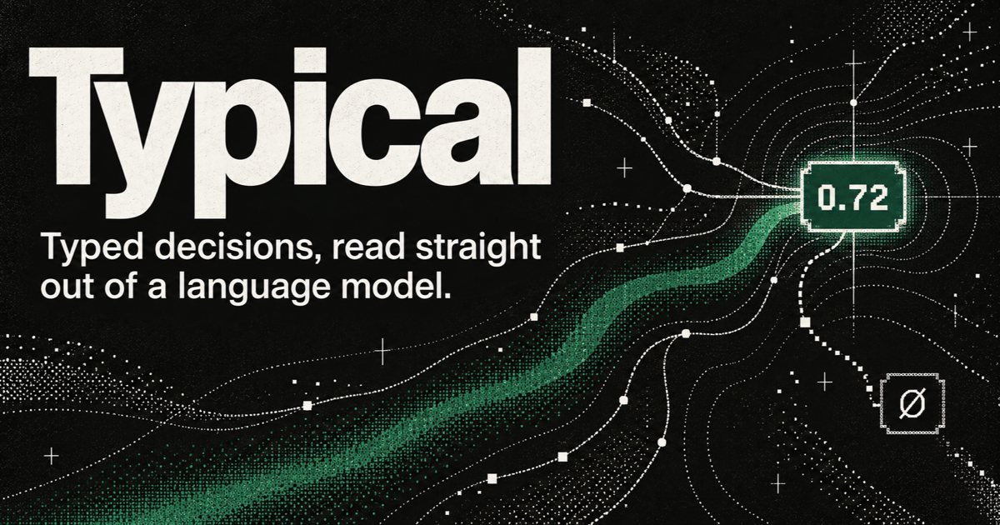

# Typical

[](https://typical.ozlabs.ai)

Typical turns a pretrained language model into a direct probabilistic decision engine. Give it a state once —
a support ticket, a policy document, an agent trace, any block of text — and it answers many independent,
runtime-defined questions against that state in parallel, as calibrated probability distributions, with an
explicit "none of the above." No generation, no JSON parsing to fix up, no re-encoding the state per question.

Three typed primitives cover the decisions software actually needs to make:

- **Choice** — pick one of K runtime-defined options (or abstain).
- **Noul** — yes/no, read from a dedicated Bernoulli head, exactly invariant to which label you call "yes."
- **Score** — an ordinal level (urgency, severity, priority), trained with ordinal-smoothed targets so the
  probability mass concentrates near the true level instead of spreading uniformly over "wrong."

The state is encoded once into a KV cache; every question is a short causal suffix scored against that cache, so
adding more questions to a state is cheap — a single decision costs 45–60 ms depending on model size, and that
cost barely moves as the candidate set K grows from 2 to 256 (REPORT.md §3ab).

## The models

| model | backbone | JevBench standard / hard (public subset) | link |
|---|---|---|---|
| `typical-small-preview` | Qwen3-1.7B-Base | .750 / .387 | https://huggingface.co/OzLabs/typical-small-preview |
| `typical-small` (v3) | Qwen3-1.7B-Base | .792 / .441 | https://huggingface.co/OzLabs/typical-small |
| `typical-medium` (v2) | **Qwen3.5-4B-Base** | .861 / .495 | https://huggingface.co/OzLabs/typical-medium |
| `typical-large-preview` | Qwen3-14B-Base | .903 / .468 | https://huggingface.co/OzLabs/typical-large-preview |

`typical-small` and `typical-medium` are Release 1: DecisionMix v2's hard curriculum, ordinal-smoothed Score,
a per-row Bernoulli Noul head, and 1,024-token decision states. `typical-small-preview` is the earlier Phase-6A
checkpoint, kept public as the reference point Release 1 is measured against. All three JevBench numbers are a
public-subset run (72 standard / 48 easy / 111 hard ids; not a ranked leaderboard entry — see each model's card).

`typical-medium` is the capability-per-millisecond knee of the ladder we've measured: +11 points of JevBench
standard and +11 points of MMLU-Pro among-K over `typical-small` for 1.25× the per-decision latency
(56–58 ms vs 45–46 ms at K = 2–32, REPORT.md §3ab/§3af). A 14B candidate (`tl1b`) reaches JevBench standard
**.931** — the best number this project has produced — but is not yet released; see `docs/plan/PROJECT.md` §1 and §7 for
why and what's still open.

### Fixed in v2 (2026-09-23): state ordering on long documents

All three public checkpoints were trained before a corpus fix (REPORT.md §3ag) and inherit a positional bias:
on long policy documents they expect the case facts **after** the policy body. Measured on 605 held-out long
states — identical items, only the position of the case block differs, no truncation at scoring:

| model | facts **last** | facts **first** | drop |
|---|---:|---:|---:|
| `typical-small-preview` | .744 | .534 | −21 pts (below the .612 majority floor on Noul) |
| `typical-small` | .798 | .598 | −20 pts |
| `typical-medium` | .866 | .612 | −25 pts |

Short states are unaffected. **Both models were re-released on 2026-09-23 with checkpoints that do not have this
bias** (`ts1c` at 1.7B: .947 facts-first; `tm2` at Qwen3.5-4B: .950), so the table above describes the *previous*
weights. Pull again if you downloaded before that date. Both replacements are trades — Small loses 6.5 points of
held-out Noul and 4.8 of BoolQ, Medium loses 5.5 of CLINC-150 and 5.3 of HWU64 — and each card states its own.
Medium's backbone changed to Qwen3.5-4B, so re-pull `inference/` from the model repo before loading it.

This also illustrates why JevBench alone is not a sufficient gate here: `ts1c` reads .708 / .432 against
`typical-small`'s .694 / .432 — statistically indistinguishable — while being 35 points better on the axis the
fix targeted. docs/research/RESULTS.md §5a carries confidence intervals for every checkpoint; every adjacent pair on that
benchmark is inside the noise.

## Quickstart

```bash
pip install typical-ai
```

```python
from typical_ai import Typical

m = Typical.from_pretrained("OzLabs/typical-small")   # or OzLabs/typical-medium
```

<details><summary>Run from a source checkout instead</summary>

```bash
pip install -r inference/requirements.txt
```

```python
from typical import Typical

m = Typical.from_pretrained("OzLabs/typical-small", device="auto")  # or "typical-medium" / "typical-small-preview"

# K-way choice over a fixed label set -> {label: p, ...} + p_null
m.choice(state, "What does the customer want?", ["refund", "replacement", "repair"])

# Yes/no -> P(yes)
m.noul(state, "Is the order still under warranty?")

# Ordinal levels -> {level: p, ...} + p_null + expected (E[index])
m.score(state, "How urgent is this ticket?", ["0", "1", "2", "3"])
```

`state` is a string or a JSON-serialisable dict. Runnable end to end: `uv run --no-sync python inference/example.py`
(`inference/example.py`). The `inference/` package (`inference/README.md`) is self-contained — no dependency on
this training repo, just `torch`, `transformers`, `safetensors`, `huggingface_hub`, `numpy` — and is numerically
verified against the internal decider (`inference/test_parity.py`, max abs probability diff `0.0` on CPU and MPS).

</details>

## Demo

```bash
uv run --no-sync python demo/app.py
```

Opens a local Gradio app at `http://127.0.0.1:7860`: a playground (one state, one question, see the probability
bar chart and latency), a batch view (one state, several questions, all scored against a single KV-encode of the
state — this is what "cached state" buys you), and the release-page tables reproduced from `releases/*.md` and
`REPORT.md` §3ab. See `demo/README.md`.

## Where the docs live

`docs/README.md` is the full map; the short version:

- `docs/plan/PROJECT.md` — start here: document map, code map, run registry, findings ledger, ops rules, open questions.
- `REPORT.md` — the consolidated results log, in chronological sections (§3a, §3b, … §3ah); every claim has a
  matched baseline and a section number.
- `docs/plan/PLAN7.md` — the current roadmap (scaling ladder, mixture sweep, typed primitives, DecisionMix v2, calibration,
  large-K path) and its execution notes.
- `docs/research/RESULTS.md` — one results table per model family/size, pulled straight from run artefacts.
- `docs/research/COMPARE.md` — the competitive picture against the closed Jev/System One family and the open JevBench leaderboard.
- `docs/research/NOVELTY.md` — the contribution story: what is and isn't novel, and why.
- `releases/*.md` — one card per public release: exact backbone/adaptation/readout, training args, full results
  tables, known limitations, license.

## How to train

Training code is not yet public (the release cards ship inference only). The Release-1 recipe at 1.7B
(`typical-small`, checkpoint `ts1b`, from `releases/typical-small.md`):

```bash
uv run --no-sync python pcdm/train.py --readout native --nc_head n3 --nc_render letters_nonull --null factored \
    --tap_layer 20 --zscore --lora_r 16 --lora_layers 8 \
    --data data_v5 --extra_data data_kb,data_wf,data_wf_hf,data_wf_long,data_wh,data_u \
    --bucket_map data_wf_long=W,data_wh=W,data_u=U \
    --family_weights E:0.40,K:0.15,W:0.35,U:0.10 --null_aug W:0.20 \
    --ordinal_smooth 0.7 --noul_head bern --max_state 1024 \
    --bs 64 --grad_accum 4 --eval_cap 1500 --steps 12000 \
    --ckpt_upload --wandb --hf_repo guychuk/pcdm-runs
```

The 4B (`typical-medium`, `tm1b`) is the same recipe on `Qwen/Qwen3-4B-Base` at tap 26/36 — see
`releases/typical-medium.md` for its exact args. `docs/plan/PROJECT.md` §6 has the current pod-ops rules (torch/kernel
pinning, micro-batch sizing, watcher rules) for anyone reproducing a run on rented GPUs.

## License and data notes

- Backbones (`Qwen/Qwen3-1.7B-Base`, `Qwen/Qwen3-4B-Base`): Apache-2.0.
- Training data is a mix of public NLU/NLI sets, a distilled knowledge-MCQ corpus, an in-repo rubric-conditioned
  workflow generator, three HF-sourced workflow datasets (MIT / Apache-2.0), and DecisionMix v2 (`data_wh`, a
  programmatic in-repo rule engine with no external license constraints; `data_u`, whose UNLI portion is MIT and
  whose `metaeval/ambient` / `metaeval/chaos-mnli-ambiguity` portions do not declare a license on their HF cards —
  flagged, not asserted). Full per-source breakdown and licenses: `releases/typical-small.md`'s Data/License
  sections.
- JevBench numbers throughout this repo are a **public-subset run** against `fstandhartinger/jevbench` v1.2.1 (72
  standard / 48 easy / 111 hard public ids) — not a submitted or ranked leaderboard entry. The 72 MIT-licensed
  original JevBench items are the only public JevBench material that is training-eligible, and none of it was
  trained on for any released checkpoint.
