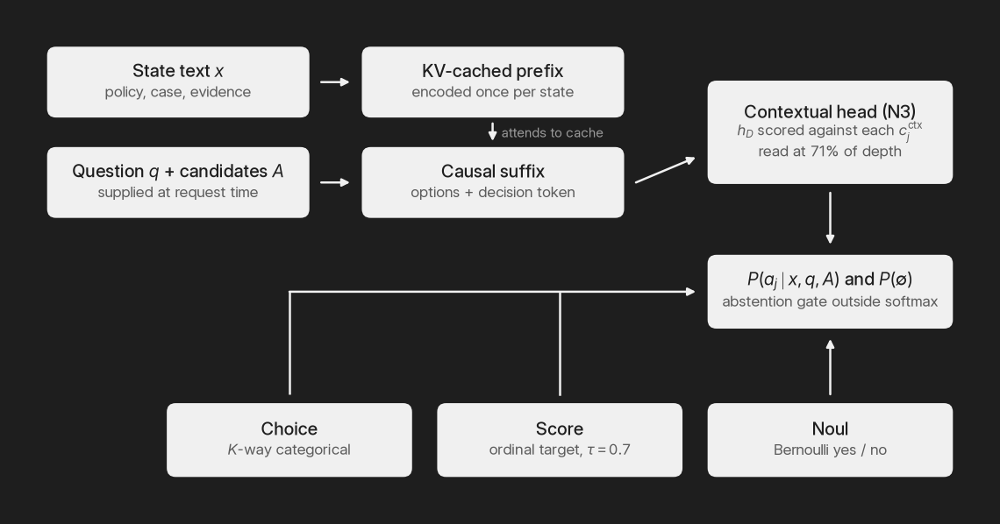
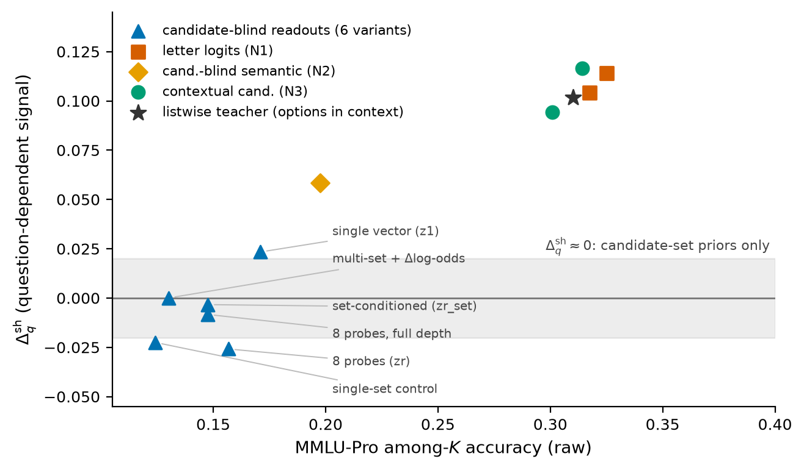
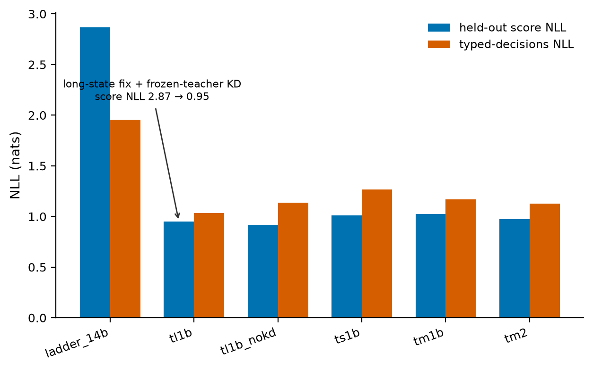
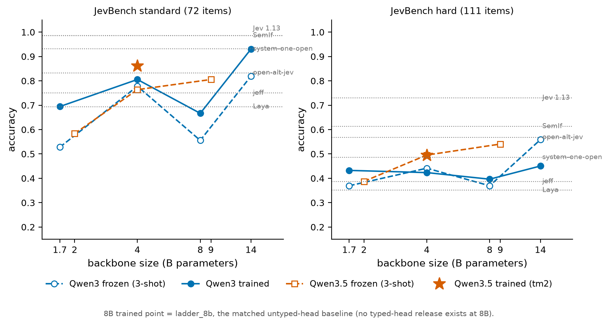
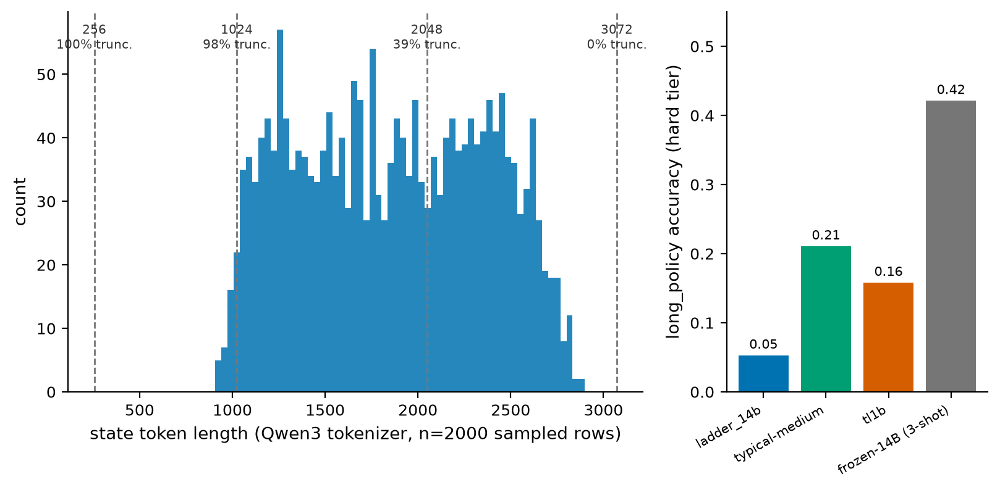
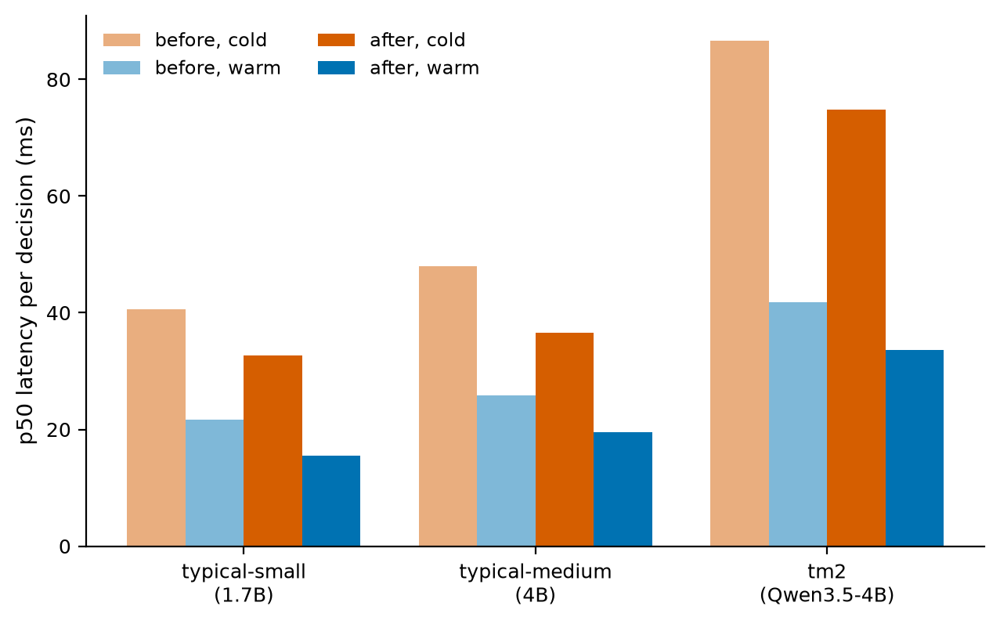

# How Typical Works, and What Broke Building It

[Typical](./typical-launch.md) is a family of open decision models. You hand one a state and a typed question, you hand it the options at call time, and it returns a probability distribution over those options plus an abstention. Nothing is generated and nothing is parsed.

The launch post covers what the models are for. This one covers how they work: the architecture down to the layer the readout reads, the training mixture and why the mixture turned out to matter as much as the architecture, the results at the resolution our evidence actually supports, and the failures that shaped each decision. Most of the design was forced by a negative result, so the two are told together.

Section markers (§3r, §3ak-c and so on) point at our internal experiment report. The repo is private today; the report publishes with the training code. The public artefacts are the three model repos on Hugging Face, which carry the weights, the inference package and the evaluation JSON every number here is read from.

One measurement caveat runs through everything below. Our JevBench numbers are against the public subset, unranked: 72 standard items drawn from only 36 independent states (two paraphrases each) and 111 hard items. Cluster-bootstrapped over those states, that is roughly ±9 points on any hard-tier number and ±6 to ±13 on standard. Where a claim leans on a small gap there, we say so, and in several places we say that the benchmark simply cannot resolve the comparison we wanted it to.

## 1. The interface, and why it has that shape

A decision call looks like this:

```
state + typed question + runtime candidate set  ->  distribution over candidates + P(∅)
```

Three properties of that signature drove the whole design.

**The candidate set arrives at runtime.** There is no output head with `refund` at index 0. Your label list is plain text supplied per call, which means the model has to read the candidates, and that turns out to be a hard architectural constraint rather than a convenience (section 2.2).

**One forward pass, no decode.** The state is encoded once into a KV cache; each question is a short suffix scored against that cache. A second question on the same document costs one short pass, not a second read of the document.

**Abstention is part of the output, not part of the label list.** "None of these fit" is the answer you route to a human or to a slower model, so it has to be a number you can threshold. That requirement alone rules out the obvious implementation (section 2.4).

## 2. Architecture

<p align="center"></p>
<p align="center"><em>One state encode, many cheap per-question reads against the cached prefix.</em></p>

The current shape has been frozen since §3r:

- A Qwen3 or Qwen3.5 base model **truncated at about 71% of its depth** (layer 20 of 28 at 1.7B, 26 of 36 at 4B and 8B, 28 of 40 at 14B). Layers above the tap are discarded, not just unused.
- **LoRA r16 on the top eight kept layers.** Everything below is frozen.
- The **state text KV-cached once** as a causal prefix.
- The **question and its candidates rendered into a short causal suffix** against that cache, ending in a terminal decision token.
- An **N3 contextual readout**: the terminal decision state scored against each candidate's own contextual hidden states, inside the same forward pass.
- A **factored abstention gate** reading set statistics of the option scores, outside the softmax over candidates.
- Three typed outputs on that one readout: **Choice** (categorical), **Score** (ordinal-smoothed categorical), **Noul** (per-row Bernoulli).

Each of those exists because something else failed first.

### 2.1 The last layer is the wrong layer

The first full-scale run read the backbone's final hidden layer, which is what you do without thinking about it. It scored 58.6 on SNLI.

58.6 is the hypothesis-only baseline for SNLI. The model was making entailment predictions without using the premise, the classic dataset-artifact failure. The top of a generative stack has been specialised for predicting the next token, and whatever cross-sentence evidence structure lived in the middle of the network was gone by the time it got there. Tapping at layer 20 of 28 took SNLI to 65.3 frozen and 68.2 with LoRA, and the NLI family loss started descending for the first time. Backbone size had been a red herring: 0.6B to 1.7B bought nothing at all until the tap moved.

The effect reappeared later in the option-conditioned architecture, where it had been confounded with the readout for several runs. Same head, same data, same steps, only the tap depth changed (§3r):

| | native readout @ 28 layers | native readout @ tap 20 |
|---|---|---|
| SNLI / MNLI / ANLI / BoolQ | .863 / .752 / .431 / .737 | **.906 / .865 / .519 / .834** |
| CLINC-150 | .740 | **.862** |
| best val NLL | .430 | **.341** |

That run also killed a story we had been telling. Before it, the record said the options-in-suffix formulation cost evidence accuracy. It did not; the depth did. Two separate claims collapsed into one when the confound was removed.

We swept tap depth once more against the current recipe, at 54%, 61% and 64% of depth (§3aj). Quality rose weakly and non-monotonically toward the deeper end, and every gain sat inside the seed-to-seed spread we had already measured for the same config. The parameter stays at 71%, filed as a closed negative. The general claim is narrower than "shallower is better": a decision head wants a representation from before the top of the stack specialises for generation, and where exactly that is has a wide flat optimum.

### 2.2 The candidates have to be in the forward pass

The architecture everyone wants is the factored one. Compute a decision state `Z(state, question)` once, without looking at the candidates, then score each candidate against it with a cheap head. Candidates become free, K scales for nothing, label vectors cache forever.

We built three versions of it and distilled a listwise teacher into them: a single decision vector, eight probes with token-level MaxSim, and probes plus O(K) cross-attention over the candidate tokens. On MMLU-Pro among-K they scored .171, .157 and .147 against the teacher's .310, which reads like partial success.

Then we ran the control (§3j). Every student was re-scored with the question replaced by a period, and again with the question shuffled:

| among-K | normal | choices only | shuffled question | question-dependent gain |
|---|---|---|---|---|
| teacher (options in context) | .310 | .222 | .208 | **+.088** |
| `z1` student | .171 | .181 | .147 | −.010 |
| `zr` student | .157 | .166 | .182 | −.009 |
| `zr_set` student | .147 | .162 | .151 | −.014 |

Every student did as well or better with the question destroyed. Their entire above-chance score was candidate-set priors: which option strings look plausible together, learned from the corpus. Nothing question-dependent had compiled into `Z`.

We tried the strongest available fix. Multi-set supervision, where the same state appears with seven different option sets and the loss targets the teacher's Δ-log-odds between them, produced a model with Δ_q(shuffled) of exactly 0.000. The set-conditioning cross-attention path stayed inert through 4k steps of direct supervision.

Then we ran the closure experiment, because every candidate-blind student had been tapped at layer 20 and §3r had just shown depth was decisive for the candidate-aware readout. Same head, full 28 layers (§3s): among-K *fell* to .147, Δ_q(shuffled) stayed at −.008, and the evidence tasks regressed exactly as a last-layer tap predicts (BoolQ −11, ANLI −8, MNLI −7).

That closes it as far as our factorisation goes. A state computed before the options are known transfers the teacher's priors and its calibration, and not its question-conditioned parametric knowledge, at any tap depth we tested. Six factorisations and objectives, every depth: all of them sit in a ±.02 band on Δ_q while the teacher and both candidate-aware readouts sit at .09 to .12. This is the project's strongest result and the one with no close prior art. It is scoped to what we built; it is not an impossibility theorem.

<p align="center"></p>
<p align="center"><em>Raw accuracy on the x-axis, question-dependence on the y-axis. Points high on x and flat on y are answering from candidate-set priors. Every candidate-blind variant lands in that band, including the one run at full depth.</em></p>

### 2.3 The contextual readout

Once the candidates are rendered into the suffix, there is still a choice about what to score.

The cheap version reads the letter logits: render the options as A/B/C/D, take the terminal state, dot it with the letter embeddings. This is the standard MCQ interface, and it works. Our N1 arm reached .325 among-K, above the listwise teacher, with Δ_q^sh of .114.

The obvious non-generative version (N2) scores the terminal decision state against a slot-agnostic semantic embedding of each candidate. It failed in an informative way: .198 among-K, and it collapsed entirely on large unseen label spaces (Banking77 at K=77 scored .012). The mechanism is that h_D encodes "the answer is the option in slot C", and a bilinear score against a semantic vector with no slot identity cannot recover that.

N3 is the fix that prediction implies. Score h_D against **each candidate's own contextual hidden states**, the ones computed inside the suffix, which carry both the candidate's meaning and its position. It matches the letter readout on every knowledge and unseen-label set (among-K .314 against .325, CLINC-heldout .916 against .918) with a quarter of its order fragility: IIA Δlog-odds .13 against .46, reorder Δp .10 against .165. A seed replicate reproduced both the parity and the fragility gap (§3v).

That is the whole claim behind the interface: candidate-conditioned pretrained reasoning can be read out directly as typed probabilities without the generative answer interface, and doing it through the candidates' own contextual states rather than through letters removes most of the order artifacts you get for free with letters.

### 2.4 Abstention is a gate, not a candidate

The obvious way to support "none of the above" is to add it to the candidate list and let the softmax sort it out. It produced the strangest failure in the project: abstention became a function of K.

| null AUROC, CLINC-150 | K=5 | K=20 | K=50 | K=150 |
|---|---|---|---|---|
| ∅ rendered as an option | .97 | .94 | .91 | 1.00† |
| ∅ as a head decision | .98 | .95 | .92 | .95 |

† Degenerate. At K=150 the model abstained on everything, which makes AUROC perfect and the model useless. At the other end, at K=5 it never abstained: P(∅ | gold absent) was .02. Banking77 at K=77 gave a null AUROC of .00 by the same mechanism.

Downstream this was not subtle. MMLU-Pro false-abstention was .692, dragging accuracy to .133. Banking77 with all 77 labels scored .063.

Moving abstention into a factored gate that reads set statistics of the option scores (max, margin, log-sum-exp) rather than competing inside the softmax fixed all of it at once (§3t). The K-sweep became monotone, MMLU-Pro false-abstention went .692 to .003 with accuracy .133 to .353, KL to the teacher went 2.43 to .27, Banking77-77 went .063 to .579, and Δ_q was unchanged at .122. It cost 2 to 7 points on intent and topic label spaces (HWU64 .801 to .757, 20NG .589 to .515) and raised option-order sensitivity.

The portable version: if you have added a "none of these" option to any classifier, check that it behaves the same way at K=5 and K=150. A null score that means something different at every candidate count cannot be thresholded, and a threshold is the entire point of having it.

### 2.5 Typed heads are contracts on the output distribution

Choice, Noul and Score are not three architectures. They are one readout with three different contracts on what the returned distribution must satisfy, and each contract is enforced by a structural choice rather than by hoping the model learns it.

**Choice** is the N3 categorical readout described above. Contract: a distribution over candidate strings you supplied, plus P(∅), with as little dependence on the order you listed them as we can manage.

**Score** is the same categorical readout trained with **ordinal-smoothed targets** (τ = 0.7). Severity 0 to 3 and priority 1 to 5 have an order; a K-way softmax treats the levels as unrelated buckets, so predicting 0 when the answer is 1 costs exactly what predicting 0 when the answer is 3 costs. Smoothing the target across adjacent levels is a loss change with no new parameters (§3ac):

| held-out urgency | K-way | ordinal-smoothed |
|---|---|---|
| accuracy | .505 | .508 |
| NLL | 2.07 | **1.23** |
| Brier | .79 | **.68** |
| ECE | .35 | **.19** |
| ordinal MAE | .58 | **.55** |

Accuracy did not move. On the 12 ordinal items in JevBench the two models produce identical per-item predictions. Every probability-quality metric improved anyway. On an external severity set the same change took accuracy .853 to .939 and MAE .15 to .06. We also tried a cumulative-link head with learned thresholds; it won JevBench standard and lost on every internal set, and at 3k steps for fresh parameters it is an open follow-up rather than a rejection.

**Noul** is a per-row Bernoulli head, `P(yes) = σ(w·h_D)`, with **no candidates rendered at all**. Contract: exact order-invariance. A 2-way Choice over `["no", "yes"]` moves P(yes) by up to .55 when you reverse the label order. The Bernoulli head moves it by zero, on all nine test sets, by construction. It was also the first thing in the project to clear an untouched external floor by a wide margin: PagerDuty .602 to .886 against a constant-prediction floor of .792.

Routing between them is per row, not global. The first attempt made `--noul_head bern` a global flag; every row was then rendered query-only and scored by the Bernoulli head, and the run collapsed to chance. It cost about $10 of H100 time. Rows whose candidate set is exactly {yes, no} now take the Bernoulli path and every other row is bit-identical to the K-way path.

### 2.6 One state encode, many questions

At inference the state text is encoded once into a prefix KV cache and each question is a short right-padded suffix scored against it, batched in chunks. A single decision at K=2 costs 45 ms at 1.7B, 57 ms at 4B and 59 ms at 14B on one H100, same pod and same torch build. An eight-times larger model is 1.3 times slower per decision, because the cached state and the short suffix dominate.

Large candidate sets are where that stops being true. The batched marginal cost per query at K=256 goes 28.0 ms at 1.7B to 109.7 ms at 14B, close to four times, while at K=2 it is 2.7 against 3.9 ms. At high K the cost of rendering every candidate through the backbone dominates, and it dominates more for bigger models, not less. That is the argument for the shortlist path in section 10.

## 3. Training

Roughly half the movement in this project came from the training distribution rather than the architecture, and we did not expect that. We now treat the mixture as a first-class variable on a par with the model.

### 3.1 The E/K/W/U mixture

Four families, sampled at fixed per-batch weights:

- **E — evidence.** NLI-style entailment, intent and topic label spaces.
- **K — knowledge.** Multiple-choice question answering.
- **W — workflow.** Rubric-conditioned decisions: routing, extraction, eligibility, urgency, tool selection, long policy documents.
- **U — uncertainty.** Soft-target rows with no single correct answer.

The mixture is not a tuning detail. The first workflow-trained model used E .35 / K .25 / W .40 and lost 11.2 points on CLINC-150 and 9.6 on TREC-fine, most of it false abstention (§3w). Raising E to .45–.50 brought NLI and BoolQ back to within a point of the untrained base model and intent and topic sets to within 3–4 points, with workflow performance unchanged (§3z). No architecture changed. The shipped 1.7B recipe is E .40 / K .15 / W .35 / U .10.

### 3.2 Counterfactual rubric groups

A decision model that memorises "this kind of ticket gets that label" is useless the first time your policy changes. The hard curriculum (`data_wh`, 60,605 training rows) is built so memorising cannot work: **100% of training rows sit in counterfactual rubric groups**, where the same state and the same candidate set appear at least twice under different rubrics with different gold answers.

That construction is the point. If a row's answer is recoverable from the state alone, or from the candidate strings alone, both members of the group would want the same answer and the loss would be unminimisable. The only way to fit the corpus is to read the rule.

The corpus is a programmatic rule engine over 12 domains crossed with 6 boolean conditions, at rule-depth levels 1 through 7. Levels 1–6 train; **level 7 is eval-only** and holds the composition families the generator deliberately never produces in training: temporal, numeric, expected-value and trade-off. Three whole domains, two rubric styles and one grammar per level are also held out, and the whole corpus is leak-checked against the JevBench public ids (0 of 231 hits).

What it bought (§3ad), against a matched control never trained on it:

| | control | with DecisionMix v2 |
|---|---|---|
| held-out family / grammar / style | .481 / .507 / .491 | **.827 / .881 / .888** |
| rubric-flip accuracy | .477 | **.710** |
| level 7 (never trained) | .477 | .498 |

The curriculum transfers inside its own rule grammar by 34 to 37 points and does not transfer outside it at all. Level-7 composition stays near .50 across the released family (.493 at 1.7B, .544 at 4B). The 14B candidate is the only checkpoint that has ever been clearly above chance there, at .620, and it is not shipping. What we generated was learned. What we did not generate was not, and capacity mostly did not substitute for it.

The uncertainty corpus (`data_u`, 31,029 rows, all soft-target) is UNLI's validation split, AmbiEnt's ambiguous rows, and four synthetic generators with exact closed-form targets. It buys calibration and costs top-1: the never-soft-trained control has higher argmax accuracy on all three uncertainty sets while the trained model has better NLL. Typed-decisions NLL went 2.06 to 1.71, the first training-side calibration gain in the record.

### 3.3 Null augmentation

Twenty percent of workflow rows are duplicated with the gold answer (and any rendered catch-all) removed, so the correct answer for that copy is ∅.

This does something an eval-time threshold cannot. We first tried fixing abstention by refitting a null-logit offset and temperature after training (§3y), and it does not work, because one global threshold cannot serve the E families and the W families at once: workflow rows are near-deterministic, so an operating point tuned for them reads ordinary entailment margins as "uncertain".

Training the behaviour instead: false-abstention on CLINC .10 to .08 and on TREC .27 to .12, and accuracy *up* by 2.6, 3.6, 4.3 and 6.0 points on CLINC, TREC, HWU64 and 20NG. Teaching the model when to abstain made it better at not abstaining. The cost is soft-target NLL, since the model now spends mass on ∅ where the gold has none. The recipe is insensitive to the exact fraction anywhere in [.10, .20].

### 3.4 Checkpoint selection on calibration

The final recipe selects the checkpoint on validation NLL over the uncertainty and curriculum sets (`--best_on`) rather than on accuracy.

The reason is a result we did not enjoy. Re-running the Release-1 candidate at batch 16 instead of 64, which is simply four times fewer examples seen, produced the best hard-tier Brier of any run in the project (.76) and hard accuracy .450, while losing ground on everything in-distribution (CLINC .733, MMLU among-K .323). Small batch is not a recipe, it is under-fitting: the same model, less confident, scores higher on the hard tier. That is fairly direct evidence that a large part of our hard-tier problem is probability quality rather than knowledge, and it is why the objective and the selection rule changed rather than the data volume.

At 14B, the recipe bundle — facts-first long states, `--drop_truncated`, the 3,072-token window, DecisionMix v2 with the U corpus, typed heads with the ordinal target, and calibration-based `--best_on` selection — took held-out score NLL from 2.87 to 0.95 and typed-decisions NLL from 1.96 to 1.04, with JevBench hard Brier .85 to .66 (§3ah).

<p align="center"></p>
<p align="center"><em>Held-out score and typed-decisions NLL across the calibration-fix sequence.</em></p>

## 4. Results, at the resolution the evidence supports

This is the part most technical posts get wrong, usually by quoting point estimates to three decimals from a benchmark that cannot support two.

Here is our JevBench public-subset table with cluster-bootstrapped intervals, resampled over the paraphrase group because the standard tier's 72 items come from only 36 independent states (20,000 resamples, §3ak-b):

| run | standard | 95% CI | hard | 95% CI |
|---|---:|---|---:|---|
| `ts1b` (typical-small v1) | .694 | [.569, .819] | .432 | [.342, .523] |
| `tm1b` (typical-medium v1) | .806 | [.694, .903] | .423 | [.333, .514] |
| `tm2` (Qwen3.5-4B) | .861 | [.778, .944] | .495 | [.405, .586] |
| `tl2` (Qwen3.5-9B) | .833 | [.722, .931] | .495 | [.405, .586] |
| `ladder_14b` | .875 | [.792, .944] | .468 | [.378, .559] |
| `tl1b` (14B, KD) | .931 | [.861, .986] | .450 | [.360, .541] |
| `tl1b_nokd` (14B, no KD) | .917 | [.833, .986] | .477 | [.387, .568] |

**Every adjacent pair in that table is statistically indistinguishable.** Hard is ±9 points at n=111 and standard is ±6 to ±13 at n_eff=36. That includes comparisons we had previously written down as findings. The claim that scale lifts standard accuracy monotonically from 1.7B to 4B to 14B is inside the interval; the ladder is a ladder, not a scaling law, and the 8B point remains an unexplained anomaly.

The sharpest illustration: `tl2` (9B) and `tm2` (4B) both score exactly 55 of 111 on hard. They are not the same model. Zero of 111 probability vectors match and they disagree on 26 items, 13 each way. McNemar gives p = 1.000 and the paired interval is [−.090, +.090]. The benchmark cannot resolve 4B against 9B here, which is a different statement from a tie.

Paired per-item tests have more power than differencing those intervals, and they are the only JevBench comparisons we will quote:

| paired comparison | diff | 95% CI | p |
|---|---:|---|---|
| frozen 14B (3-shot) − `tl1b`, hard | +.108 | [+.027, +.189] | **.015** |
| frozen 14B (3-shot) − `tl1b_nokd`, hard | +.081 | [−.009, +.171] | .082 |
| `tl1b_nokd` − `tl1b` (KD off vs on), hard | +.027 | [−.027, +.090] | .45 |
| `ts1b_semif` − `ts1b`, standard | +.097 | [−.056, +.250] | .23 |
| `tl2` (9B) − `tm2` (4B), hard | .000 | [−.090, +.090] | 1.00 |

Exactly one of those five clears significance. Across the entire record only three paired results survive at all: frozen-beats-trained on the hard tier, the rendering effect of section 6, and the long-state result of section 5. Everything else we have written down about JevBench is a direction, not a finding.

One of those rows retired an earlier claim of ours. We had written that the frozen-teacher distillation in the 14B run "contributed nothing measurable and was slightly negative on the hard tier". The paired test says +.027 [−.027, +.090], p = .45. The honest statement is that no effect of KD is detectable in either direction at this sample size, which is weaker than "KD did not help" and much weaker than "KD hurt". The direction was consistent across several metrics, which is worth recording and is not evidence.

<p align="center"></p>
<p align="center"><em>JevBench standard and hard accuracy across the size ladder, trained and frozen. Read the vertical spread against the intervals above before reading any two points as a ranking.</em></p>

## 5. The long-state defect, and three attempts to measure it

This is the best worked example we have of the difference between an effect that is real and an effect that is measurable, and it ended up reshaping both public releases.

### The defect

Our long-policy training corpus (23,318 rows) renders the case facts at the end: policy document first, then `Case: <facts> <request>`. State lengths run p10/p50/p90 = 1,190 / 1,845 / 2,490 tokens. The training loader right-truncated states at `--max_state`, which we verified empirically keeps the start and drops the end.

At the 1,024-token window Release 1 used, **98.8% of those rows lost their facts before the model ever saw them.** At the 256-token window the earlier scaling ladder used, all of them did. For a stretch of this project we were training models to answer confidently about text that had been cut off, and the symptom was visible if you knew to read it: long-document policy accuracy of .053 for the 14B ladder run, with high confidence attached.

The fixes were to regenerate the corpus facts-first (case position inside the first 8% of the text) and to stop truncating. `--drop_truncated` discards a row that does not fit the window rather than quietly cutting it, which is the right default for any loader handling data with a payload at a known position.

### The ablation that could not confirm it

The counterfactual corpus was still on disk, so the ablation was clean to set up: two 1.7B arms, byte-identical flags, a 1,024-token window with `--drop_truncated` deliberately off so truncation bites exactly as it did in Release 1, differing only in which render of the same 23,318 rows is the training file. Identical rows, identical labels, identical lengths, `Case:` at position 0.000 or 0.976 of the text.

It came back underpowered. The pre-registered primary metric, JevBench's hard-tier `long_policy` family, gave .316 for the facts-first arm against .105 for facts-last. That is the predicted direction and it is 6 items against 2, out of 19. Fisher exact two-sided p = 0.232, bootstrap interval on the difference [−0.053, +0.474] containing zero, and the hard aggregate going the other way (.378 against .396). Nineteen items cannot settle this.

### The eval set built to answer the question

So we built one: 605 held-out long states, zero exact-state overlap with either training corpus and Case-stem overlaps dropped, scored with no truncation at all (window 4,096, state p50 1,965 tokens, max 2,843). Two families: `policy_permit`, 330 items at K=2 with a majority-class floor of .612, and `action_select`, 275 items at K=4 with a floor of .233.

Every item is rendered both ways, so both models can be scored in matched and mismatched conditions. That 2 × 2 is what separates the truncation effect from the render effect (§3ak-a):

| trained on | scored on | overall | policy_permit | action_select |
|---|---|---:|---:|---:|
| facts-first | facts-first *(matched)* | **.942** | .933 | .953 |
| facts-first | facts-last | .797 | .788 | .807 |
| facts-last | facts-first | .640 | .615 *(at floor)* | .669 |
| facts-last | facts-last *(matched)* | .830 | .842 | .815 |

Comparing each model in its own matched condition removes the render confound entirely. **Facts-first training is ahead by 11.2 points: .942 against .830, 95% CI [+.077, +.147], p = 5e-10.** Per family, policy_permit +.091 [+.043, +.139] and action_select +.138 [+.086, +.190].

It replicates at 14B, with `tl1b_nokd` as the facts-first arm and `ladder_14b` as the facts-last arm (§3ak-c): **+.078, 95% CI [+.055, +.100], p = 7e-12**. The gap is smaller at 14B only because the facts-first 14B is at ceiling (.997). And it replicates at a second seed of the 1.7B pair: **+.111 against +.112**, with every cell of the 605-item measurement reproducing to within a point (§3ak-e).

Two side findings fell out of the same 2 × 2. The facts-first 1.7B is the more robust model, losing 14.5 points when the render is switched against it against the facts-last model's 19.0. At 14B that difference essentially vanishes (7.6 against 6.8), so capacity appears to buy render tolerance, which the 1.7B pair alone would have missed.

### What this changed about the released models

The fixed checkpoints already existed. `ts1c` was trained as the tap-20 control in the depth sweep, on the post-fix defaults, and was filed as a negative on JevBench-shaped grounds before anyone scored it on long states:

| checkpoint | facts-first | facts-last | policy_permit (facts-first) |
|---|---:|---:|---:|
| `typical-small` v1 (`ts1b`) | .598 | .798 | .536 |
| **`ts1c`** | **.947** | .790 | **.948** |
| `typical-medium` v1 (`tm1b`) | .612 | .866 | .555 |
| **`tm2`** (Qwen3.5-4B) | **.950** | .879 | **.967** |

Both v1 releases carried a 20 to 25 point deployment trap. Callers write their own state text, and if the case facts go before the policy body, which is the natural ordering, the model lands at or near the majority-class floor on the yes/no family. Both fixed checkpoints are strictly better or equal, and both shipped on 2026-09-23 as v2.

<p align="center"></p>
<p align="center"><em>Left: how much of a long-policy row survives each token budget. Right: the 19-item JevBench long_policy family across the bug-and-fix sequence, which is the measurement the next two sections argue we should not have been steering by.</em></p>

## 6. Rendering is a first-class factor

The 2 × 2 above forced a general conclusion: **a benchmark score is capability plus interface compatibility**, and if you do not control the rendering you cannot tell which one you measured. We have three independent demonstrations of it, all on our own numbers.

**Rendering alone, with no training at all.** A frozen Qwen3.5-9B moves 12.5 points on JevBench standard, .806 to .931, purely by changing how the state and options are laid out in the prompt (p < .001). All three Qwen3.5 sizes we tested moved the same way under the same change.

**Train/test render mismatch inside one model.** On the 605-item set, with the case fully visible in both conditions and no truncation anywhere, moving the case from the end of the state to the start costs the facts-last-trained model 23 points on the policy_permit family, .842 to .615, and drops it exactly onto its .612 majority-class floor. It is not that the model cannot use the facts; it uses them only where its training put them.

**A benchmark number that was never a capability measurement.** `ladder_14b` reads **.053** on JevBench's `long_policy` family. On 605 held-out long states in its own matched render it reads **.919**. That single pair is the cleanest illustration we have: the .053 compounds truncation damage, a render mismatch against JevBench's fixed format, and a 19-item sample, and none of those three is capability.

We apply this to our own results and only to our own results. It is a reason to control rendering before reading a benchmark delta as an architectural difference, including every delta in this post. It is not a reason to discount anyone else's published numbers.

## 7. What a 19-item metric did to us

JevBench's `long_policy` family has n = 19. Across two seeds of the same matched comparison it gave 6/19 against 2/19, a four-item gap in the predicted direction, and then 5/19 against 5/19, exactly zero. Same two recipes, same protocol, opposite verdicts. The purpose-built 605-item set gave +.112 and +.111 on the same pair.

Had the second seed been the one we ran first, we would have recorded the truncation mechanism as **refuted**. Separately, the same family gave a checkpoint a .053 that the 605-item set showed to be .919. Three conclusions this project nearly reached from that one cell would have been wrong.

The lesson is narrower and more useful than "small samples are noisy". We had pre-registered a decision rule on that metric before running the experiment, which is the thing you are supposed to do, and it did not help. **Pre-registering a rule is not sufficient; the rule has to be pre-registered on a metric with the power to resolve the effect size in question.** Our pass rule for `typical-large` (hard ≥ .559, long_policy ≥ .35) fails that test on both terms: both are point thresholds on quantities whose intervals are wider than the effects being gated.

Where a question mattered, the fix was to build an eval set big enough to answer it rather than to analyse the small one harder. The 605-item set is a generator script and a leak check, no GPU time at all, and it settled a question that two matched H100 runs and a pre-registered protocol could not.

## 8. Where our training makes the model worse

The uncomfortable number: on JevBench's hard tier, a frozen 14B base model reading letter logits with three examples in its prompt scores .559. Our trained 14B decision checkpoint scores .450, and its no-KD control .477.

Unlike most comparisons on this benchmark, that one survives a paired per-item test: **+.108 [+.027, +.189], p = .015**. The equivalent test against the no-KD control does not (+.081, p = .082). So there is one arm where we can say the frozen model with three exemplars beats our trained model on the tier we care most about, and one where we cannot.

The per-family breakdown on the no-KD control shows where it comes from: adversarial .833, trap 1.00, routing 1.00, multi-hop .50, judge-hard .588, probability .50, ambiguous .429, long-policy .211, temporal and numeric .20, trade-off .167. Anything that resembles a workflow decision under a rubric is fine. Anything that requires carrying an intermediate value through several steps is near chance.

Whether that reflects a limit of direct readout or a limit of this training recipe is open, and the rendering factor from section 6 weakens any strong causal reading of the frozen-model comparison, since the frozen arm and the trained arm are not scored through the same interface. It is a real gap and we do not currently know which of the two things it is evidence for. Designing the experiment that separates them is item 3 in section 11.

A related data point that points the same way: a frozen Qwen3.5-9B under the better rendering scores .595 on hard, above the .495 of the best checkpoint we have trained at any size, again with overlapping intervals. Backbone generation appears to buy more on this tier than our training does.

The generalisable version: a frozen model with a few examples in context is not a strawman to clear before shipping. It is a ceiling to check you have actually cleared, per tier, and we publish the tiers where we have not.

## 9. Three bugs that cost more than any architecture change

**A deep copy in the serving path.** The inference package encoded the state once into a prefix KV cache and scored each question's suffix against it, which is the whole point of the architecture. It also deep-copied the entire prefix cache on every single decision, because mutating a shared cache is the kind of bug you find in production and the copy made it impossible. Replacing the copy with a stride-0 view (bit-identical output, zero bytes allocated), plus caching the attention masks and position tensors and capping rendered option text:

| warm p50 per decision | before | after |
|---|---|---|
| `typical-small` (1.7B) | 21–25 ms | **15.5–17 ms** |
| `typical-medium` v1 (4B) | 26–27 ms | **19–21 ms** |
| Qwen3.5-4B | 42–53 ms | 34–46 ms |

A quarter to a third of serving latency, for a change that removes code. We tried `torch.compile` and CUDA graphs on top and rejected both: 8 ms on a single shape, but probabilities moved by up to .1 across shape buckets and the mutable HF cache produced stale-buffer crashes. Manual per-bucket graph capture is the remaining path to roughly 10 ms and we have not done it.

<p align="center"></p>
<p align="center"><em>Removing the deep copy took roughly a quarter to a third off warm p50 latency across the family.</em></p>

**A padding mask with the wrong dtype.** The SDPA padding mask was being built as a `long` tensor, which silently forces PyTorch into its O(L²) math kernel. That was the cause of our 14B out-of-memory failures at 3,072-token states, and of a lot of memory pain before that. The fix was `bool`.

**No BOS token.** Qwen3 has no beginning-of-sequence token, so position 0's hidden state is content-independent. The cosine similarity between the position-0 states of `neutral`, `yes` and `transfer` was 0.9998. Every single-token candidate we embedded was, numerically, the same vector. Prepending `<|endoftext|>` and dropping it fixed it. This was the very first bug in the project and it produced a model that trained, converged and was completely inert.

## 10. Releases

Both v2 releases shipped on 2026-09-23, and both are trades. The model cards name the regressions:

| release | checkpoint | backbone | gains | losses |
|---|---|---|---|---|
| `typical-small` v2 | `ts1c` | Qwen3-1.7B-Base | +34.9 long-state facts-first | −6.5 held-out Noul, −4.8 BoolQ, −3.7 uncertainty, −3.4 Score, −2.8 style |
| `typical-medium` v2 | `tm2` | Qwen3.5-4B-Base | +33.8 long-state, +7.2 JevBench hard, +5.6 standard | −5.5 CLINC-150, −5.3 HWU64 |

`typical-large` is withheld. The 14B candidate reached .931 on JevBench standard, the best number this project has produced, and missed its own pre-registered pass rule on the hard tier and on long-document policy. It would also be wrong to ship it against that rule now, because as section 7 argues the rule itself needs restating on metrics with power.

One release-engineering note worth passing on. The Qwen3.5-capable `inference/typical/backbone.py` had to be published to all three model repos **before** the medium weights, because 60 of `tm2`'s 124 LoRA tensors sit on modules the previous loader did not know about (Gated-DeltaNet projections, the VL-wrapper unwrap, the `linear_attn` parent walk). Weights first would have given every user a load failure on their first call. The change is purely additive and every new branch is `hasattr`-guarded, so no Qwen3 path moved.

The API, the install flow and the per-suite evaluation tables are in the [launch post](./typical-launch.md).

## 11. What is open, in priority order

1. **Restate the release gate.** No further release decision gets made on point thresholds over a 19-item family or a ±9-point aggregate. The gate moves to the 605-item set and to paired per-item tests.
2. **Level-7 composition.** Temporal, numeric, expected-value and trade-off decisions sit near .50 across the released sizes and .62 at 14B, and it is the axis nothing in the suite has reliably moved. The curriculum that lifted every other held-out family by 34 points does not touch it, because the generator never produces it. This is generator work before it is scale.
3. **The hard-tier gap against the frozen backbone.** Design an experiment that separates "direct readout is insufficient for this tier" from "this training recipe is insufficient", with rendering controlled on both arms. Until that exists, section 8 is a measurement and not an explanation.
4. **A calibration objective on the U corpus.** Log-likelihood plus λ·Brier plus the ordinal term, reported per type, with no global temperature. The evidence that this is the right target is section 3.4: the under-fit run scored best on the hard tier by being less confident.
5. **Retrain Small without its regression.** The v2 losses on Noul, BoolQ and Score are a data-mixture question, not an architectural one.
6. **The large-K path.** Marginal cost per query at K=256 grows nearly four times from 1.7B to 14B. The plan is an energy-style front end producing a top-r shortlist that the native readout then scores, which keeps the interface and drops the scaling term.
7. **Training code.** The repo is private and every public model card currently promises it.

Closed and not reopening: candidate-blind decision-state compilation, further readout variants, confidence-only expert routing, alternative null functional forms, and the tap-depth sweep, which is a matched negative.

---

The models are on Hugging Face: [`OzLabs/typical-small`](https://huggingface.co/OzLabs/typical-small), [`OzLabs/typical-medium`](https://huggingface.co/OzLabs/typical-medium) and the earlier [`OzLabs/typical-small-preview`](https://huggingface.co/OzLabs/typical-small-preview). Each repo carries the weights, the self-contained `inference/` package and the evaluation artefacts every number here is read from. Training code and the full experiment report follow.
