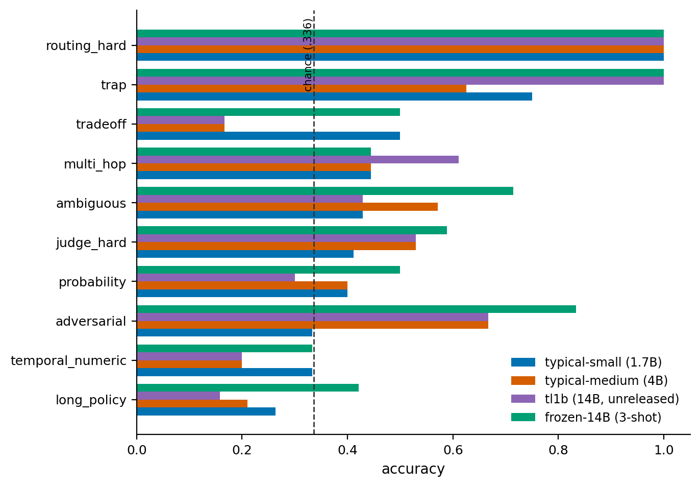
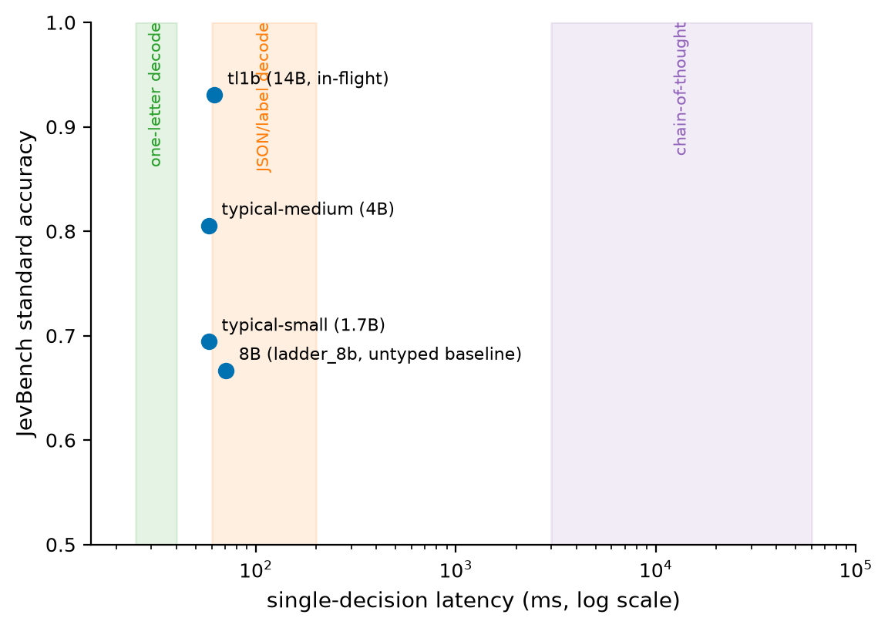

# Typical: Models That Decide, Not Generate

Most AI calls inside software don't need prose. A router needs one destination. A policy check needs yes or no. An incident system needs a severity. An agent needs its next action.

We usually build all of those out of a model trained to generate text:

```
prompt -> tokens -> parser -> decision
```

Every stage after the first is overhead. The model writes a sentence you throw away, your parser hopes it picked one of your options and not a fourth one it invented, and the "confidence" field that comes back was the model grading its own homework.

Typical has a different interface:

```
state + typed question -> probability distribution
```

No generated answer. Nothing to parse. Today we're releasing **Typical Small** (1.7B) and **Typical Medium** (4B), open-weight decision models for three primitives: Choice, Noul, and Score.

## Show me

```python
from typical import Typical

m = Typical.from_pretrained("OzLabs/typical-small", device="auto")

m.choice(state, "What does the customer want?", ["refund", "replacement", "repair"])
```

```
refund       .82
replacement  .11
repair       .05
∅            .02
```

(Shape of a real return value.) The label list is plain text you supply at call time. The model was never trained on this particular set of three words, and there is no classifier head with `refund` baked into index 0. The output space belongs to your program, not to the model.

## Three decision primitives

- **Choice** — pick one of K options defined at runtime.
- **Noul** — return P(yes) for a proposition.
- **Score** — return a distribution over ordered levels.

```python
m.choice(state, "What does the customer want?", ["refund", "replacement", "repair"])
m.noul(state,   "Is the order still under warranty?")
m.score(state,  "How urgent is this ticket?", ["0", "1", "2", "3"])
```

Each is a different head on the same backbone, and the difference is structural.

Choice reads your label strings, so it can operate over label sets that were never hard-coded into an output head. On CLINC-150 (151 intents) `typical-small` scores .801 and `typical-medium` .847; on 20 Newsgroups, an entirely different label vocabulary, .540 and .588; on held-out workflow families neither model trained on, .818 and .865.

Noul is not `Choice(["yes", "no"])`. It has a dedicated Bernoulli head with no candidate text rendered at all, so its answer cannot change because "yes" and "no" were listed in a different order. On the shipped `typical-small` checkpoint, reversing label order leaves P(yes) exactly unchanged on 10 of 11 held-out test sets and moves it by .009 on the eleventh. Held-out noul accuracy is .710 for Small and .811 for Medium.

Score knows adjacent levels are related. A severity of 2 is closer to 3 than to 0, so we train it with ordinal-smoothed targets rather than treating levels as unrelated buckets. In the isolated ablation that cut held-out score NLL from 2.07 to 1.23 without changing a single top-1 prediction on the JevBench ordinal items.

## Abstention is a decision, not a label

All three primitives can say "none of these fit," and that answer comes from a separate head rather than an extra entry in your label list.

The difference is not cosmetic. When we rendered "none of the above" as just another option, abstention became a function of how many candidates you passed: at 150 it always abstained, at 5 it never did. A null score that means something different at every K cannot be thresholded, which kills the thing you wanted it for, namely routing the uncertain cases to a human or a slower model. Moving abstention into its own head removed the pathology outright.

## How it works

Typical reads the state once.

The state (a ticket, a document, an agent trace) becomes a cached model prefix. Each decision is then a short question scored against that same prefix. Instead of decoding an answer token, Typical reads the hidden states of the question and its candidates directly and turns them into probabilities. Adding a second question to the same state costs one short forward pass, not a second read of the document.

<p align="center"></p>
<p align="center"><em>One state encode, many cheap per-question reads against the cached prefix.</em></p>

For technical readers: the released models use a truncated Qwen3 base model with LoRA on the upper retained layers, a candidate-aware contextual readout over the terminal decision state, and separate Choice, Noul and Score heads sharing that backbone.

We train on four kinds of decision: evidence (NLI-style), knowledge (multiple choice), workflows, and uncertainty (soft targets). The workflow portion includes counterfactual rubric groups, described below.

## The released models

| model | size | JevBench standard\* | JevBench hard\* | CLINC-150 | warm p50 |
|---|---|---|---|---|---|
| `typical-small` v2 | 1.7B | .708 | .432 | .797 | 15.5–17 ms |
| `typical-medium` v2 | 4B (Qwen3.5) | .861 | .495 | .795 | 19–21 ms |

\* Public-subset run against JevBench v1.2.1 (72 standard / 111 hard public ids), not a ranked leaderboard entry. Majority baselines on this split are .311 standard and .336 hard, and at n_eff ≈ 36 on standard, small gaps are noise. Latency is warm p50 per decision on one H100 through the public inference package.

Medium is the better model for a small latency increase, and consistently so: it leads Small by 5 points on CLINC-150, 11 on MMLU-Pro among-K, 10 on held-out yes/no decisions and 5 on the composition curriculum. The JevBench standard gap (.694 to .806) points the same way, though at 36 independent states that tier alone would not settle it. Neither released model solves the hard compositional tier: long-policy, multi-step, temporal, unit and trade-off decisions sit far below the standard tier for both.

We also trained a 14B research candidate. Before training it we wrote down a release bar (hard-tier accuracy ≥ .559 or hard-tier Brier ≤ .65, and long-document policy accuracy ≥ .35). It reached .931 on the standard tier, the best number this project has produced, and still missed the bar on both counts, narrowly on Brier (.656) and by a wide margin on long-document policy (.158). So it isn't shipping.

## Rules are part of the input

A decision model that memorises "this kind of ticket gets that label" is useless the moment your policy changes. So much of the workflow training is counterfactual: the same state and options appear under different rubrics with different correct answers, forcing the model to read the rule instead of pattern-matching the state.

It works inside the rule grammar we generate and stops at its edge. On held-out rubric-flip items, where the rule is inverted and the state unchanged, `typical-small` scores .801 and `typical-medium` .833. On level-7 composition, which mixes temporal, unit, expected-value and trade-off reasoning and which our generator never produces, they sit at .49 and .54. What we generate is learned. What we don't generate is not.

## Where direct decisions still break

Every model we've trained, at every size, does worse on the hard tier than on the standard tier. This is the project's clearest open problem, and it isn't obviously a capacity problem: a frozen 14B backbone with three examples in its prompt and no training at all scores .559 on that tier, against .450 for our trained 14B candidate. At 111 items those intervals overlap, so we won't claim the frozen model wins. We will say training bought nothing measurable on this tier, which is not what we expected.

<p align="center"></p>
<p align="center"><em>Hard-tier accuracy by family. Long-document policy and serial-symbolic composition drag the average down independently.</em></p>

The honest version of the question: when is a direct decision enough, and when does a decision need intermediate computation to get there? We don't know yet, and we'd rather say so than describe the hard tier as solved.

Two other places Typical is the wrong tool today: candidate sets in the hundreds or thousands need a retrieval front end feeding a shortlist to the decision head, and Choice keeps some sensitivity to the order you list options in. Noul does not, by construction.

## The bug we shipped, and the fix

Both models were re-released on 2026-09-23 to fix this. If you pulled them before that date, pull again.

The checkpoints we first published were trained on a corpus whose long states rendered the case last, and they picked up that ordering. We measured it on 605 held-out long policy states, identical content in both conditions, only the position of the case block different, with no truncation at scoring time:

| model | facts last | facts first |
|---|---|---|
| `typical-small-preview` | .744 | .534 |
| `typical-small` | .798 | .598 |
| `typical-medium` | .866 | .612 |

Twenty to twenty-five points, and on the yes/no subset the preview model drops below the majority-class floor, meaning you would do better answering "yes" to everything than calling it that way. Short states are unaffected.

We found this while testing whether a data bug we had already fixed was the cause of a separate problem. The current weights, published on 2026-09-23, reach **.947** (Small) and **.950** (Medium) on that same test, so either ordering works now.

Both replacements are trades rather than clean upgrades, and the model cards say so. Small gains 34.9 points on long states and loses 6.5 on held-out yes/no decisions, 4.8 on BoolQ and 3.4 on Score. Medium gains 33.8 on long states, 7.2 on JevBench hard and 5.6 on standard, and loses 5.5 on CLINC-150 and 5.3 on HWU64. Medium also moved to a Qwen3.5-4B backbone, so re-pull the inference package from the model repo before loading it. The previous weights remain in each repository's git history if the older behaviour suited your workload better.

## Four things that surprised us

1. The last layer of the language model was the wrong layer to decide from.
2. Candidates had to participate in the computation, not be scored against a state computed before they arrived.
3. Abstention had to be architecture, not vocabulary.
4. One KV-cache deep copy was costing a quarter to a third of serving latency.

Each of those started as a bug or a failed run. [Read the technical deep dive →](./technical-deep-dive.md)

## What's open today

Open weights and inference code, today, on Hugging Face: [`OzLabs/typical-small`](https://huggingface.co/OzLabs/typical-small) and [`OzLabs/typical-medium`](https://huggingface.co/OzLabs/typical-medium), plus the earlier [`OzLabs/typical-small-preview`](https://huggingface.co/OzLabs/typical-small-preview) as a reference point. Each repo carries the weights, the self-contained `inference/` package, and the evaluation artefacts every number here is read from (`eval_wf_full.json`, `jevbench_summary.json`), so you can check the tables against the files rather than against us.

Both checkpoints are Apache-2.0 over Apache-2.0 Qwen3 base models, and the training recipe is documented down to the exact flags in the model cards. Training code and the full experimental report are not public yet, and neither is a packaged `pip` install. Those are what we're preparing next.

One data-licensing note we'd rather state than bury: most of the training mix is public NLU data, permissively licensed workflow datasets and in-repo generators, but two portions of the uncertainty corpus (`metaeval/ambient` and `metaeval/chaos-mnli-ambiguity`) declare no license on their Hugging Face cards. We flag that rather than assert it's fine, and it's part of why the data release trails the weights.

## Try it

The inference package ships inside each model repo:

```bash
huggingface-cli download OzLabs/typical-small --local-dir typical-small
pip install -r typical-small/inference/requirements.txt
```

```python
import sys; sys.path.insert(0, "typical-small/inference")
from typical import Typical

m = Typical.from_pretrained("OzLabs/typical-small", device="auto")  # or "OzLabs/typical-medium"

m.choice(state, "What does the customer want?", ["refund", "replacement", "repair"])
m.noul(state,   "Is the order still under warranty?")
m.score(state,  "How urgent is this ticket?", ["0", "1", "2", "3"])
```

It needs `torch`, `transformers`, `safetensors`, `huggingface_hub` and `numpy`, and nothing from our training stack. `example.py` in the same directory runs end to end.

Pick one bounded decision your software currently makes by calling an LLM and parsing the answer. Write down the label set as it actually varies at runtime. Swap the generation step for `choice`, `noul` or `score`, and test it on your own labels. If the model abstains a lot, that's telling you something about your label set. If a frozen larger model with a few examples beats it, believe that number before you believe ours.

## Category context

TypeSafe's Jev helped establish this class of model: state plus a typed question in, probabilities out, no text to parse. It's closed and API-only, with no published weights. A growing open ecosystem has formed around the same primitive, with more than forty entries on the public JevBench leaderboard.

Typical is our version of it, built so that the weights, the inference stack, the recipe, the experiments and the failures are all inspectable. The leading entries on that leaderboard are still ahead of us on the hard tier, which is the number we're working on.

<p align="center"></p>
<p align="center"><em>The Typical family's latency against the bands a normal LLM call falls into depending on how it has to answer.</em></p>

Next: a calibration objective aimed at the hard tier, generator work on the composition families, a Qwen3.5 port already in progress, and `typical-large` if the 14B clears its own bar.
